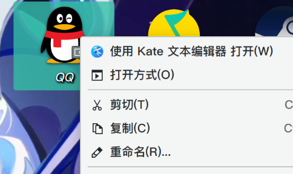
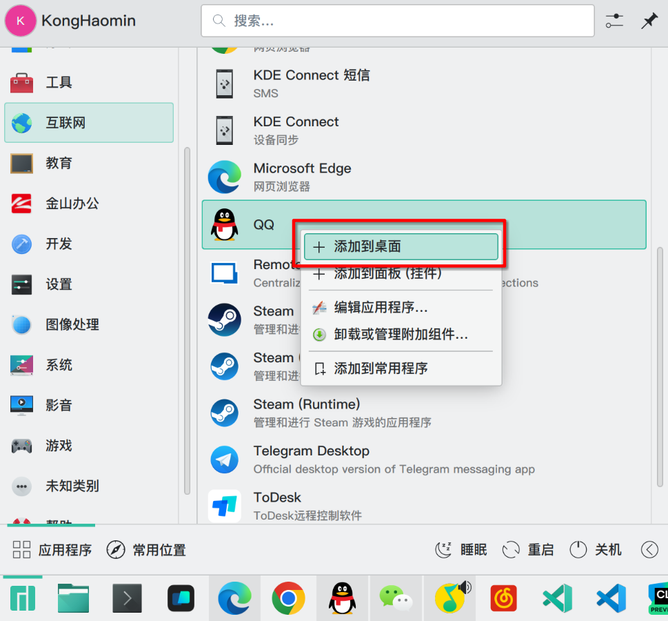

# Chrome以及Electron输入法

## 支持的浏览器

- Google Chrome
- Google Chrome Beta
- Google Chrome Dev
- Google Chrome Canary
- Google Chromium
- Microsoft Edge
- Microsoft Edge Beta
- Microsoft Edge Dev
- Microsoft Edge Canary

## 支持的Election程序

- VSCode
- VSCode-Insiders
- VSCode-OSS
- VSCode-OSS-Insiders
- VSCodium
- VSCodium-Insiders
- QQ
- QQ Music

## 详细步骤(傻瓜式)

## Ref

https://fcitx-im.org/wiki/Using_Fcitx_5_on_Wayland#Chromium_.2F_Electron
