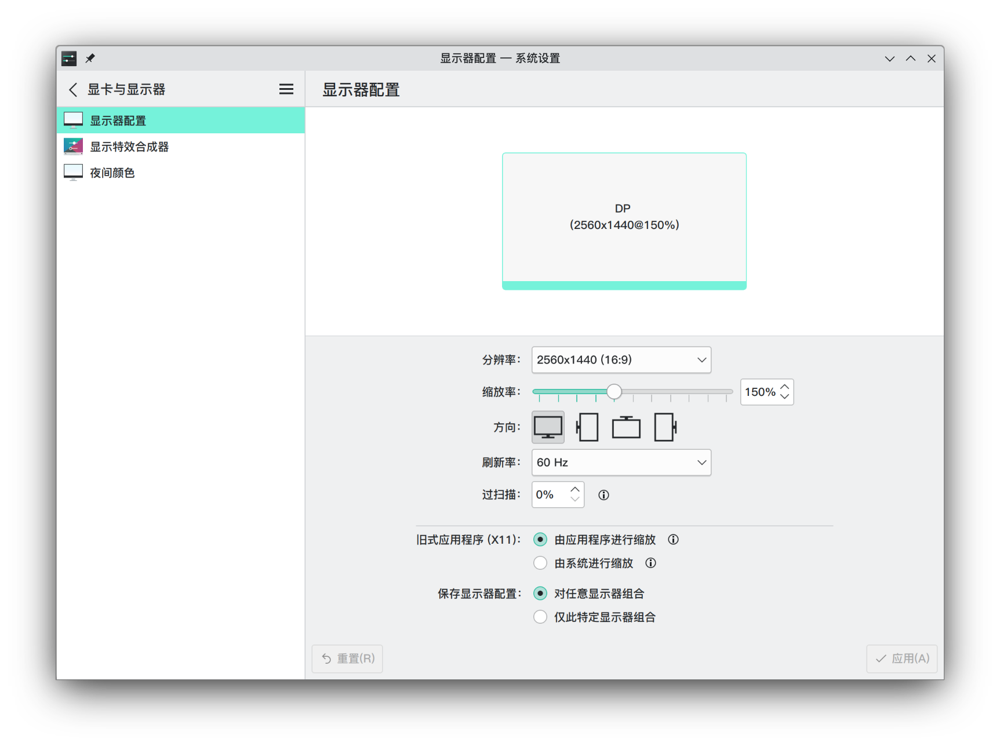
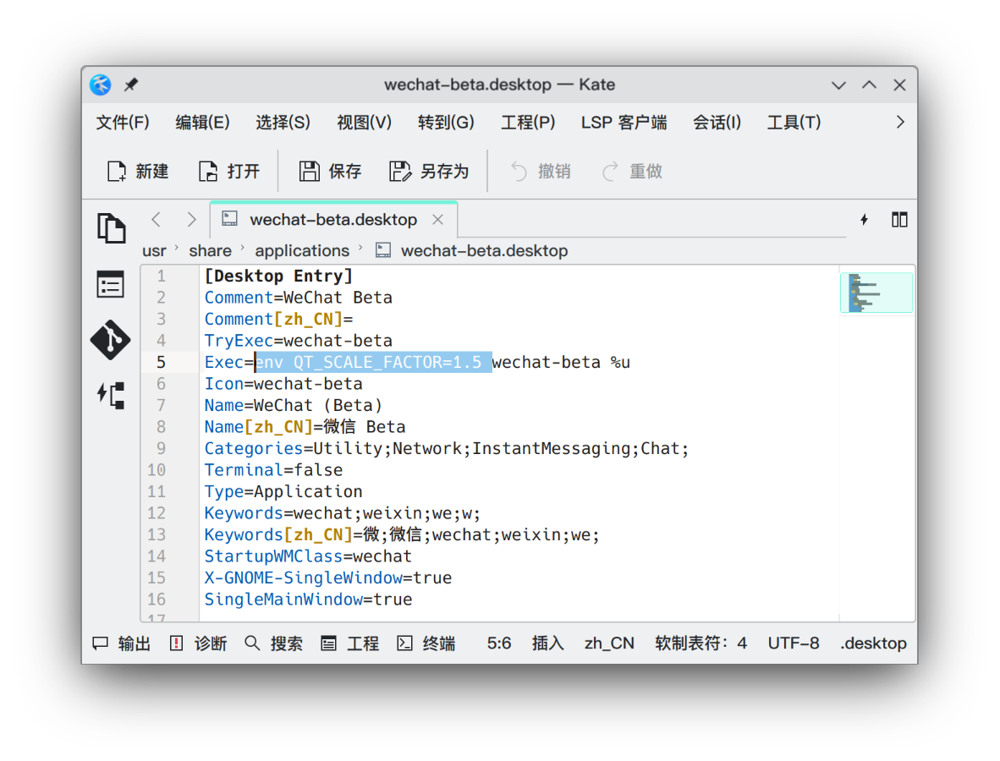

# 微信Beta缩放

微信Beta采用Qt框架，因此使用Qt的方法即可！

## 方法

设置环境变量`QT_SCALE_FACTOR`为您喜欢的比例。



比如我在操作系统设置的比例为150%，因此只需要设置`QT_SCALE_FACTOR=1.5`即可。

## 设置方法

=== "对单个程序设置"

    如果您不希望影响其他程序，请修改`.desktop`文件以实现仅对单个程序生效。

    
    
    ```
    Exec=env QT_SCALE_FACTOR=1.5 wechat-beta %u
    ```

=== "设置系统的环境变量"

    将下面的内容添加到`~/.bashrc`或`~/.zshrc`等Shell环境的配置文件中。
    
    ```bash
    export QT_SCALE_FACTOR=1.5
    ```
