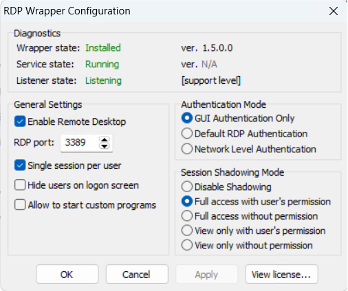

# RDP

## RDP Enhence

https://github.com/stascorp/rdpwrap

### rdpwrap.ini的更新

https://github.com/affinityv/INI-RDPWRAP/blob/master/rdpwrap.ini

https://blog.csdn.net/ty0_0/article/details/114862541
https://blog.csdn.net/u010804317/article/details/104011926

## RDP Multi-User Connection

https://post.smzdm.com/p/aeked05z/

https://www.cnblogs.com/heardic/p/14012001.html
https://www.cnblogs.com/hyyx/p/15207866.html
https://www.cnblogs.com/hyyx/p/15149135.html
https://blog.csdn.net/beyondqd/article/details/8524313
https://blog.csdn.net/weixin_46031767/article/details/122937892

https://blog.csdn.net/gtj0617/article/details/136551002

## RDP Windows Defender Firewall

https://blog.csdn.net/michaelehome/article/details/79555799

## Multi-User Open RDP

https://blog.csdn.net/m0_49113674/article/details/109908233

## WebVpn

如果学校的网页版WebVpn无法连接，需要使用`RDPWrap`将`Authentication Mode`选择为`GUI Authentication Only`。

